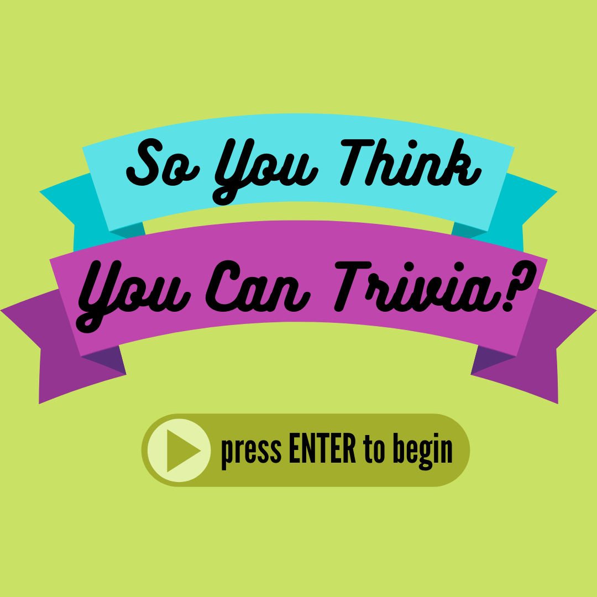

# So You Think You Can Trivia?

**Author**: Janani Rajadurai

##About
_So You Think You Can Trivia?_ is an app where you can test you knowledge of unique trivia through quizzes! You can
 pass your own quizzes into the application via commandline and take your own quizzes!

##Dependencies
###Cinder
1. Download [Cinder](https://libcinder.org/) for your platform and extract it into a folder
2. Open the folder and build it in your IDE
3. Create a new folder inside the one you just made
4. You can put this project inside the newest folder
####Windows Users
- You must have [Visual Studio 2015](https://visualstudio.microsoft.com/) to build this project

##Libraries Used
- [csv2](https://github.com/p-ranav/csv2) - csv file parser
- [gflags](https://github.com/gflags/gflags) - commandline flags processing

##How To Play _So You Think You Can Trivia?_
- When you first build the project, you may run into this error

        error C2440: '<function-style-cast>'

  in line 66 of 'reader.hpp'
- You can remedy this by replacing
    
        
    mmap_ = mio::mmap_source(filename);
    
   with
   
    std::error_code error;
    mmap_.map(filename, error);
- Once that is fixed, you can run the application and take the quizzes as many times as you'd like!
- If you would like to provide your own quizzes, you can do so from the commandline
    - Make sure you save your quiz as a csv file that has exactly 4 answer choices and 1 correct answer for each 
    question. Your format should be:
            
            Question1,Choice A,Choice B,Choice C,Choice D,Answer
    - Make sure your file is saved in the assets folder so that the program can access your quiz correctly
    - Enter your quizzes (you can provide up to 4) as flags as so
    
            --filename1=usersquiz1.csv --filename2=usersquiz2.csv
###Rules
- Once you start a quiz, you must finish it
- You can leave answers blank
- You can skip around questions and change your answers any time before submitting the quiz to be scored!
- If you provide an invalid quiz to the program you will have to choose a different quiz to take
#### Keyboard

| Key     | Action                                                      |
|---------|-------------------------------------------------------------|
| `ENTER` | Start the game, finish your quiz for scoring, and play again|                         |
| `1`     | Choose quiz 1                                               |
| `2`     | Choose quiz 2                                               |
| `3`     | Choose quiz 3                                               |
| `4`     | Choose quiz 4                                               |
| `A`     | Choose answer A                                             |
| `B`     | Choose answer B                                             |
| `C`     | Choose answer C                                             |
| `D`     | Choose answer D                                             |
| `<--`   | Go back a question                                          |
| `-->`   | Go forward a question                                       |